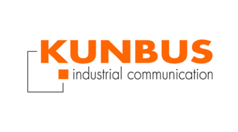

    

        

            

                

                    
NulvaEdge

                    <h1>Secure and Intelligent Edge Computing Software</h1>
                    
With NuvlaEdge, turn your hardware into a smart edge device.
<a class="btn btn-link" role="button">Discover our solutions</a>
                

                

                    <form class="shadow bg-white">
                        <h3>Start your free trial</h3>
                        
<input class="form-control" type="text" placeholder="First name" name="First name" required=""><input class="form-control" type="text" placeholder="Last name" name="Last name" required="">

                        
<input class="form-control" type="text" placeholder="E-mail" name="E-mail" required="">

                        
<input class="form-control" type="text" placeholder="Password" name="Password" required="">

                        
<input class="form-control" type="text" placeholder="Confirm password" name="Confirm password" required="">

                        
<button class="btn btn-secondary" type="submit">Sign up for Nuvla</button>
                            

                                
Sign up with

                            

                        

                    </form>
                

            

        

    

    

        
<ol class="breadcrumb container">
    <li class="breadcrumb-item"><a href="#">Products</a></li>
    <li class="breadcrumb-item">NulvaEdge</li>
</ol>

        

            <ul class="nav nav-tabs" id="anchor-nav-menu">
                <li class="nav-item"><a class="nav-link active" href="#overview">Overview</a></li>
                <li class="nav-item"><a class="nav-link" href="#features">Features</a></li>
                <li class="nav-item"><a class="nav-link" href="#techspecs">Tech specs</a></li>
                <li class="nav-item"><a class="nav-link" href="#hardware">Hardware</a></li>
            </ul>
        

    

    

        

        

            

                <h2 class="text-light">What does NulvaEdge do?</h2>
            

            

                
NuvlaBox software turns any ARM or x86 single board computer into a smart edge device, managed from Nuvla.io.

                
The software is open source, secure and installs in minutes.

            

        

    

    

        

        <h2>Main features </h2>
        

            

                

                    <h3><strong>Flexibility</strong></h3>
                    
<strong>Affordable for small and large deployments, for small to large customers.&nbsp;</strong>Edge-to-cloud doesn’t have to be a difficult journey. The NuvlaBox software is simple to install and even industrialise. A perfect first step into edge computing transformation. With the NuvlaBox, you get an affordable entry point into edge-to-cloud, with a human sized team available to accompany you.

                

            

            

                

                    <h3><strong>Private App Store</strong></h3>
                    
Deploy apps on your edge devices from your Nuvla.io Private App Store and private Docker registry. This means applications, packaged as containers, are provisioned in 1-click from a catalogue of pre-defined blueprints. 1000s of blueprints are already available in Docker Hub and you be created by your own. SixSq can also help you find the right partner is your are missing a piece of the puzzle.

                

            

            

                

                    <h3><strong>Connectivity</strong></h3>
                    
Certified for all common forms of IP connectivity, the NuvlaBox powered edge device can communicate on mobile (3G, 4G and soon 5G), Ethernet, Wi-Fi and even satellite. When registering a NuvlaBox, a secured VPN connection is established with Nuvla.io. From there you can control your edge devices as if there were on you private network.

                

            

        

        

            

                

                    <h3><strong>Container Ready</strong></h3>
                    
Any application packaged as Docker containers, and built for your hardware platform (i.e. ARM, x86) can be deployed on a NuvlaBox powered edge device. You can also manage multi-container apps using Docker Compose and Docker Swarm. This means you can create highly available apps at the edge and in the cloud.

                

            

            

                

                    <h3><strong>Cost Savings</strong></h3>
                    
By moving to containers, you can replace several physical servers with a single NuvlaBox. And with the Nuvla.io secured remote management platform, you can centralise your operations and save on network costs, while improving security and privacy.. Why clog up your office with ugly and noisy servers when you could have a highly optimised, silent and simple to operate edge-to-cloud solution?

                

            

            

                

                    <h3><strong>Full stack, full power</strong></h3>
                    
Unlike most edge solutions, the NuvlaBox software provides you a full stack, from the operating system and up. This mean you can bring your favourite tools, language and libraries to build your edge app. This facilitates reuse and gets you where you want to be faster.We also don’t force on you a specific Software Development Kit (SDK), avoiding lock-in and unnecessary constraints.

                

            

        
<button class="btn btn-primary btn-collapse collapsed" type="button" data-bs-target="#all-features" data-bs-toggle="collapse" aria-controls="all-features" aria-expanded="false" style="margin-top: 30px;">Discover all featuresShow main features</button>
        

            

                

                    

                        <h3><strong>Hyperconverged</strong></h3>
                        
The NuvlaBox software turns any certified x86 and ARM platform into a hyperconverged system, where users can “carve” as much resources as needed for a given application. This means applications can happily run alongside each other, even on small devices, with minimum impact on each other. Via the&nbsp;<a href="https://sixsq.com/products-and-services/nuvla-io/overview">Nuvla.io</a>&nbsp;management platform, containerised applications can be dynamically deployed, monitored and updated, without needing to change the hardware.

                    

                

                

                    

                        <h3><strong>Made in Switzerland</strong></h3>
                        
The Nuvla.io service is operated and hosted in Switzelrand. The NuvlaBox and Nuvla software is also designed Switzerland. Working closely with our hardware and distribution partners, we guarantee that the product is integrated and certified according to our highest standards. While an international team, we pride ourselves in our constant quest for precision and excellence.

                    

                

                

                    

                        <h3><strong>Open Source</strong></h3>
                        
NuvlaBox is now fully open source software, and we ensure that the entire stack, including its dependencies, is Apache 2.0 compatible. This means that we leverage the latest innovations from the thriving open source communities, but also their maturity. From there, you are able to build your own edge-to-cloud journey, knowing that there is no lock-in.

                    

                

            

            

                

                    

                        <h3><strong>Support Linux OS</strong></h3>
                        
The NuvlaBox software runs on most Linux operating systems, as long as they support Docker. We have also&nbsp;<a href="https://docs.nuvla.io/">documented</a>&nbsp;how to build your own Docker images. If you have your own Linux foundation and want to certify it run NuvlaBox software, get in touch.

                    

                

                

                    

                        <h3><strong>Plug-and-Play</strong></h3>
                        
NuvlaBox is a turn-key solution. From factory settings, you plug it in, power it up and you are good to go. The automated and secured registration process ensures that each edge device is yours and uniquely configured and initialised. This even includes a dedicated set of credentials for Virtual Private Network (VPN) access.

                    

                

                

                    

                        <h3><strong>Remote Control</strong></h3>
                        
NuvlaBoxes are remotely controlled, using a secured connection, giving you full visibility and manageability of each edge device and the applications running inside of them. This feature works on all IP connectivity, even if the NuvlaBox is connected to the network via a private IP. It also works with intermittent connectivity, which is common in many field scenarios.

                    

                

            

            

                

                    

                        <h3><strong>Ruggedised</strong></h3>
                        
Working with specialists&nbsp;<a href="https://sixsq.com/products-and-services/nuvlabox/hardware">hardware vendors</a>, you can create ruggedised platforms, for extreme weather and environments. The same applies for connectivity, including satellite. Combined with our robust software, this means your NuvlaBoxes have the best chance to survive their mission, even in harsh and semi-connected environments. And if a device is compromised, you can use Nuvla.io to isolate the device, while it gets investigated.

                    

                

                

                    

                        <h3><strong>Security</strong></h3>
                        
Once powered-up, the box initiates a secured connection to&nbsp;<a href="https://sixsq.com/products-and-services/nuvla-io/overview">Nuvla.io</a>. Once the secured registration process is done, each NuvlaBox is unique and assigned to a specific user organisation. This means that any device can be controlled remotely and isolated (quarantined), upgraded or downgraded should any problems arise. We also work with expert partners to build the most secured edge solution, delivering solutions for stringent applications and highly regulated industries.

                    

                

                

                    

                        <h3><strong>Simplicity</strong></h3>
                        
Smart factory settings and zero config means it’s a child’s play to set up and use. You can even ship your edge hardware with minimum configuration and let a non-expert in the field register and activate the NuvlaBoxes in a simple and secure manner. Combined with its&nbsp;<a href="https://sixsq.com/products-and-services/nuvla-io/overview">Nuvla.io</a>&nbsp;remote-control capabilities, this means you don’t need IT experts on-site anymore. And you can watch and manage your growing edge assets from the comfort of your centralised Nuvla.io dashboard.

                    

                

            

        

    

    

        

        

            

                <h2 class="text-light">What does NulvaEdge do?</h2>
            

            

                
<strong>The NuvlaBox software is open source and can be found on&nbsp;<a href="#">Github</a>. </strong>

                
You will also find detailed manual installation instructions on our documentation website.

                
The installation of the NuvlaBox software can easily be industrialised, such that it can be rolled out at scale, from your factory. Get in touch to help you set this up for your application.

            

        

    

    

        

            

                

            

            <h2 class="title-seperation text-center">Become an Expert</h2>
            
Created by this Cristóvão (Cris) Cordeiro, R&amp;D Project Manager at SixSq, this Youtube channel gives you all the detailed information needed to master Nuvla.io and created amazing edge-to-cloud solutions.
<iframe allowfullscreen="" frameborder="0" src="https://www.youtube.com/embed/s0NQjTgmaU0" class="video-frame col-lg-10 offset-lg-1" width="100%"></iframe>
        

    

    

        

            

            <h2>Hardware to transform into NulvaEdge </h2>
            
The NuvlaBox software runs on most single board computers, both x86 and ARM architectures.

            

            
The manufacturers below provide edge hardware already certified to run the NuvlaBox software.

            

                

                    

                        
Build It OnLogic. Industrial computers you can rely on.
<a class="btn btn-light" role="button" href="https://nuvla.io/" target="_blank">Learn more</a>
                    

                

                

                    

                        
Edgeline series by Hewlett Packarde Enterprise
<a class="btn btn-light" role="button" href="https://nuvla.io/" target="_blank">Learn more</a>
                    

                

                

                    

                        
Simple ARM single board computer
<a class="btn btn-light" role="button" href="https://nuvla.io/" target="_blank">Learn more</a>
                    

                

            

            

                

                    

                        
Open Source IPC based on Raspberry Pi
<a class="btn btn-light" role="button" href="https://nuvla.io/" target="_blank">Learn more</a>
                    

                

                

                    

                        
NVIDIA Jetson: The AI platform for autonomous everything
<a class="btn btn-light" role="button" href="https://nuvla.io/" target="_blank">Learn more</a>
                    

                

                

                    

                        
Gateways &amp; Embedded Computers by Dell
<a class="btn btn-light" role="button" href="https://nuvla.io/" target="_blank">Learn more</a>
                    

                

            

            
Have different hardware? Get in touch, chances are that it’ll work right out of the box. And we’ll be happy to help you with certification.
<a class="btn btn-primary" role="button" href="#" target="_blank">Contact us</a>
        

    

    

        

            <h2>They trust us</h2>
            

                

                    

                        

                            
Lorem ipsum dolor sit amet, consectetur adipiscing elit, sed do eiusmod tempor incididunt ut labore et dolore magna aliqua. Ut enim ad minim veniam, quis nostrud exercitation ullamco laboris nisi ut aliquip ex ea commodo consequat. Duis aute irure dolor in reprehenderit in voluptate velit esse cillum dolore eu fugiat nulla pariatur. Excepteur sint occaecat cupidatat non proident, sunt in culpa qui officia deserunt mollit anim id est laborum.

                            
Firstname Lastname

                            
Jobtitle

                        

                    

                    

                        

                            
Lorem ipsum dolor sit amet, consectetur adipiscing elit, sed do eiusmod tempor incididunt ut labore et dolore magna aliqua. Ut enim ad minim veniam, quis nostrud exercitation ullamco laboris nisi ut aliquip ex ea commodo consequat. Duis aute irure dolor in reprehenderit in voluptate velit esse cillum dolore eu fugiat nulla pariatur. Excepteur sint occaecat cupidatat non proident, sunt in culpa qui officia deserunt mollit anim id est laborum.

                            
Firstname Lastname

                            
Jobtitle

                        

                    

                

                
<a class="carousel-control-prev" href="#carousel-1" role="button" data-bs-slide="prev">Previous</a><a class="carousel-control-next" href="#carousel-1" role="button" data-bs-slide="next">Next</a>

            

        

    

    

        

            

                

                    <h2 class="text-light">Start your own journey to the edge with Nuvla.io</h2>
                

                
<a class="btn btn-secondary" role="button" href="#" target="_blank">Start your free trial</a><a class="btn btn-primary" role="button" href="#" target="_blank">Request a demo</a><a class="btn btn-primary" role="button" href="#" target="_blank">Contact us</a>

            

        

    

