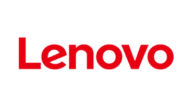
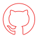

<!DOCTYPE html>
<html lang="en">

<head>
    <meta charset="utf-8">
    <meta name="viewport" content="width=device-width, initial-scale=1.0, shrink-to-fit=no">
    <title>SixSQ</title>
    <link rel="apple-touch-icon" type="image/png" sizes="180x180" href="assets/img/favicons-180.png">
    <link rel="icon" type="image/png" sizes="16x16" href="assets/img/favicons-16.png">
    <link rel="icon" type="image/png" sizes="32x32" href="assets/img/favicons-32.png">
    <link rel="icon" type="image/png" sizes="180x180" href="assets/img/favicons-180.png">
    <link rel="icon" type="image/png" sizes="192x192" href="assets/img/favicons-192.png">
    <link rel="icon" type="image/png" sizes="512x512" href="assets/img/favicons-512.png">
    <link rel="stylesheet" href="assets/bootstrap/css/bootstrap.min.css">
    <link rel="stylesheet" href="assets/css/Bauziet%20Norm.css">
    <link rel="stylesheet" href="https://fonts.googleapis.com/css?family=Poppins:300,300i,400,400i,500,500i,600,600i">
    <link rel="stylesheet" href="assets/css/Map-Clean.css">
    <link rel="stylesheet" href="assets/css/styles.compiled.css">
</head>

<body data-bs-spy="scroll" data-bs-target="#anchor-nav-menu">
    <header class="fixed-top">
        

            

                

                    <nav class="navbar navbar-light navbar-expand-lg">
                        
<button data-bs-toggle="collapse" class="navbar-toggler" data-bs-target="#navcol-1">Toggle navigation</button>
                            

                                <ul class="navbar-nav">
                                    <li class="nav-item dropdown"><a class="dropdown-toggle nav-link" aria-expanded="false" data-bs-toggle="dropdown" href="#">Products&nbsp;</a>
                                        
<a class="dropdown-item" href="#">Product overview</a><a class="dropdown-item" href="#">Nuvla Ecosystem</a><a class="dropdown-item" href="#">Nuvla Platform</a><a class="dropdown-item" href="#">Nuvla Marketplace</a><a class="dropdown-item" href="#">NuvlaEdge</a>

                                    </li>
                                    <li class="nav-item dropdown"><a class="dropdown-toggle nav-link" aria-expanded="false" data-bs-toggle="dropdown" href="#">Case Studies&nbsp;</a>
                                        
<a class="dropdown-item" href="#">All case studies</a><a class="dropdown-item" href="#">Transport</a><a class="dropdown-item" href="#">Retail</a><a class="dropdown-item" href="#">Manufacturing</a>

                                    </li>
                                    <li class="nav-item"><a class="nav-link" href="#">Pricing</a></li>
                                    <li class="nav-item dropdown"><a class="dropdown-toggle nav-link" aria-expanded="false" data-bs-toggle="dropdown" href="#">Resources</a>
                                        
<a class="dropdown-item" href="#">Resources in a nutshell</a><a class="dropdown-item" href="#">News</a><a class="dropdown-item" href="#">Blog</a><a class="dropdown-item" href="#">Videos</a><a class="dropdown-item" href="#">Webinar</a><a class="dropdown-item" href="#">Edge Knowledge Base</a><a class="dropdown-item" href="#">White papers</a>

                                    </li>
                                    <li class="nav-item dropdown"><a class="dropdown-toggle nav-link" aria-expanded="false" data-bs-toggle="dropdown" href="#">Company</a>
                                        
<a class="dropdown-item" href="#">About us</a><a class="dropdown-item" href="#">Contact</a><a class="dropdown-item" href="#">Customers</a><a class="dropdown-item" href="#">Partners</a><a class="dropdown-item" href="#">R&amp;D</a><a class="dropdown-item" href="#">Jobs</a><a class="dropdown-item" href="#">Legal notice</a>

                                    </li>
                                </ul><a class="btn btn-primary" role="button" href="https://nuvla.io/" target="_blank">Nuvla.io</a><input type="search">
<ul id="search-results"></ul>

                            

                        

                    </nav>
                

            

        

    </header>
    

        

            

                

                    <h1><strong>Partnership Boosts Innovation</strong> </h1>
                    
We work closely with several key partners to bring the best solutions to our customers.

                

            

        

    

    

        
<ol class="breadcrumb container">
    <li class="breadcrumb-item"><a href="#">Home</a></li>
    <li class="breadcrumb-item">Partners</li>
</ol>

    

    

        

            

                

                    

                        <h3>CANCOM </h3>
                        
As a Digital Transformation Partner, CANCOM accompanies organisations into the digital future. CANCOM delivers tailor-made IT end to end from a single source. 
<a class="btn btn-light" role="button" href="https://nuvla.io/" target="_blank">Learn more</a>
                    

                

                

                    

                        <h3>Dell </h3>
                        
Dell helps organisations and individuals build their digital future and transform how they work, live and play.
<a class="btn btn-light" role="button" href="https://nuvla.io/" target="_blank">Learn more</a>
                    

                

                

                    

                        <h3>ELEKTRON </h3>
                        
ELEKTRON is an established partner for technology in Switzerland and DACH region for the energy and industrial markets. The company is strongly committed to minimising the use of resources by increasing energy efficiency. 
<a class="btn btn-light" role="button" href="https://nuvla.io/" target="_blank">Learn more</a>
                    

                

            

            

                

                    

                        <h3>EXOSCALE </h3>
                        
SixSq is technology partner to Exoscale, the leading Swiss cloud service provider. With services covering the full cloud infrastructure spectrum, Exoscale provides a simple and scalable experience in order to let its clients focus on their core business. 
<a class="btn btn-light" role="button" href="https://nuvla.io/" target="_blank">Learn more</a>
                    

                

                

                    

                        <h3>Hewlett Packard Enterprise </h3>
                        
SixSq is a Hewlett Packard Enterprise OEM Partner. HPE offers worldwide IT, technology &amp; enterprise products and services. This expertise combined with SixSq’s knowledge of cloud and edge computing makes an ideal partnership.
<a class="btn btn-light" role="button" href="https://nuvla.io/" target="_blank">Learn more</a>
                    

                

                

                    

                        <h3>Lenovo </h3>
                        
Lenovo is a Fortune Global 500 company, operating in 180 markets around the world. Lenovo solutions help customers easily deploy edge-compute services that use small cells and other private network topologies. 
<a class="btn btn-light" role="button" href="https://nuvla.io/" target="_blank">Learn more</a>
                    

                

            

            

                

                    

                        <h3>NAGRA </h3>
                        
The Kudelski Group is a global leader in digital security and convergent media solutions for the delivery of digital and interactive content. Its three main activity sectors include integrated Digital Television, cyber security solutions and Public Access solutions. 
<a class="btn btn-light" role="button" href="https://nuvla.io/" target="_blank">Learn more</a>
                    

                

                

                    

                        <h3>ONLOGIC </h3>
                        
OnLogic provides advanced, flexible, highly-configurable small form factor computers. SixSq’s cloud neutral and container native edge management platform coupled with the wide range of products offered by OnLogic offers agile edge to cloud solutions.
<a class="btn btn-light" role="button" href="https://nuvla.io/" target="_blank">Learn more</a>
                    

                

                

            

            

                

                    

                        

                            <h3><strong>Hyperconverged</strong></h3>
                            
The NuvlaBox software turns any certified x86 and ARM platform into a hyperconverged system, where users can “carve” as much resources as needed for a given application. This means applications can happily run alongside each other, even on small devices, with minimum impact on each other. Via the&nbsp;<a href="https://sixsq.com/products-and-services/nuvla-io/overview">Nuvla.io</a>&nbsp;management platform, containerised applications can be dynamically deployed, monitored and updated, without needing to change the hardware.

                        

                    

                    

                        

                            <h3><strong>Made in Switzerland</strong></h3>
                            
The Nuvla.io service is operated and hosted in Switzelrand. The NuvlaBox and Nuvla software is also designed Switzerland. Working closely with our hardware and distribution partners, we guarantee that the product is integrated and certified according to our highest standards. While an international team, we pride ourselves in our constant quest for precision and excellence.

                        

                    

                    

                        

                            <h3><strong>Open Source</strong></h3>
                            
NuvlaBox is now fully open source software, and we ensure that the entire stack, including its dependencies, is Apache 2.0 compatible. This means that we leverage the latest innovations from the thriving open source communities, but also their maturity. From there, you are able to build your own edge-to-cloud journey, knowing that there is no lock-in.

                        

                    

                

                

                    

                        

                            <h3><strong>Support Linux OS</strong></h3>
                            
The NuvlaBox software runs on most Linux operating systems, as long as they support Docker. We have also&nbsp;<a href="https://docs.nuvla.io/">documented</a>&nbsp;how to build your own Docker images. If you have your own Linux foundation and want to certify it run NuvlaBox software, get in touch.

                        

                    

                    

                        

                            <h3><strong>Plug-and-Play</strong></h3>
                            
NuvlaBox is a turn-key solution. From factory settings, you plug it in, power it up and you are good to go. The automated and secured registration process ensures that each edge device is yours and uniquely configured and initialised. This even includes a dedicated set of credentials for Virtual Private Network (VPN) access.

                        

                    

                    

                        

                            <h3><strong>Remote Control</strong></h3>
                            
NuvlaBoxes are remotely controlled, using a secured connection, giving you full visibility and manageability of each edge device and the applications running inside of them. This feature works on all IP connectivity, even if the NuvlaBox is connected to the network via a private IP. It also works with intermittent connectivity, which is common in many field scenarios.

                        

                    

                

                

                    

                        

                            <h3><strong>Ruggedised</strong></h3>
                            
Working with specialists&nbsp;<a href="https://sixsq.com/products-and-services/nuvlabox/hardware">hardware vendors</a>, you can create ruggedised platforms, for extreme weather and environments. The same applies for connectivity, including satellite. Combined with our robust software, this means your NuvlaBoxes have the best chance to survive their mission, even in harsh and semi-connected environments. And if a device is compromised, you can use Nuvla.io to isolate the device, while it gets investigated.

                        

                    

                    

                        

                            <h3><strong>Security</strong></h3>
                            
Once powered-up, the box initiates a secured connection to&nbsp;<a href="https://sixsq.com/products-and-services/nuvla-io/overview">Nuvla.io</a>. Once the secured registration process is done, each NuvlaBox is unique and assigned to a specific user organisation. This means that any device can be controlled remotely and isolated (quarantined), upgraded or downgraded should any problems arise. We also work with expert partners to build the most secured edge solution, delivering solutions for stringent applications and highly regulated industries.

                        

                    

                    

                        

                            <h3><strong>Simplicity</strong></h3>
                            
Smart factory settings and zero config means it’s a child’s play to set up and use. You can even ship your edge hardware with minimum configuration and let a non-expert in the field register and activate the NuvlaBoxes in a simple and secure manner. Combined with its&nbsp;<a href="https://sixsq.com/products-and-services/nuvla-io/overview">Nuvla.io</a>&nbsp;remote-control capabilities, this means you don’t need IT experts on-site anymore. And you can watch and manage your growing edge assets from the comfort of your centralised Nuvla.io dashboard.

                        

                    

                

            

        

    

    

        

            

                

                    <h2 class="text-light">Start your own journey to the edge with Nuvla.io</h2>
                

                
<a class="btn btn-secondary" role="button" href="#" target="_blank">Start your free trial</a><a class="btn btn-primary" role="button" href="#" target="_blank">Request a demo</a><a class="btn btn-primary" role="button" href="#" target="_blank">Contact us</a>

            

        

    

    <footer>
        

            

                

Copyright © 2022 SixSq SA. All rights reserved.  |  <a href="#" class="text-dark">Terms &amp; conditions</a>

                    
SixSq, Nuvla, NuvlaBox are registered trademarks of SixSq SA in Switzerland and other countries.  Other registered trademarks are owned by their owner. 

                    
<a href="https://www.ekinops.com/" target="_blank">SixSq is an Ekinops Company.&nbsp; &nbsp; </a>

                

                

                    
Follow us

                

            

        

    </footer>
    
    
</body>

</html>